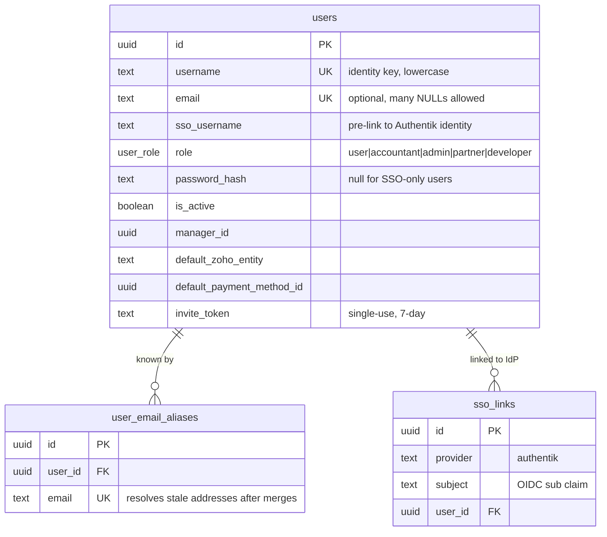
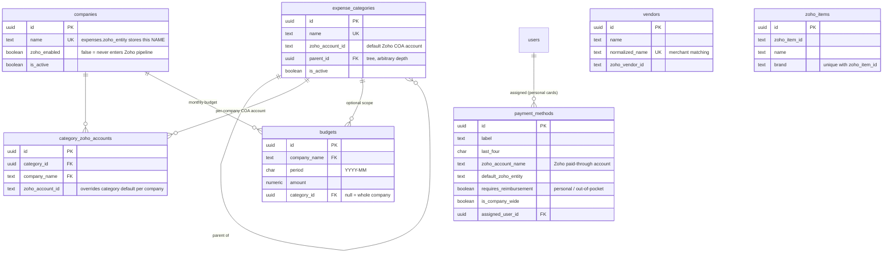
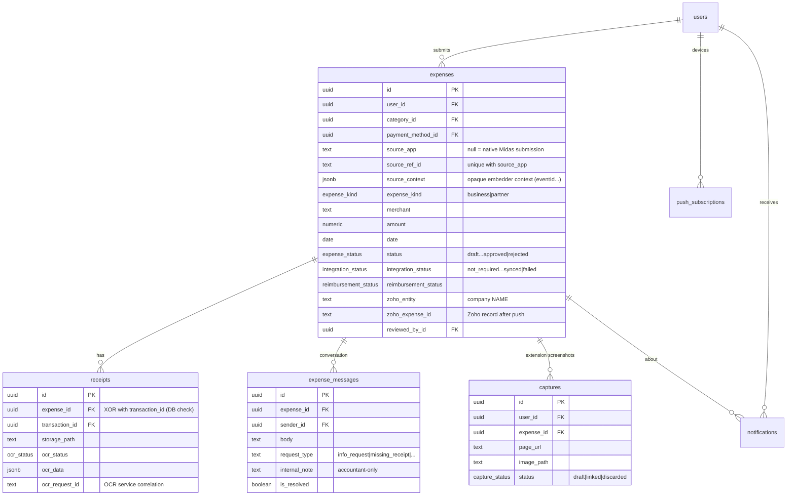
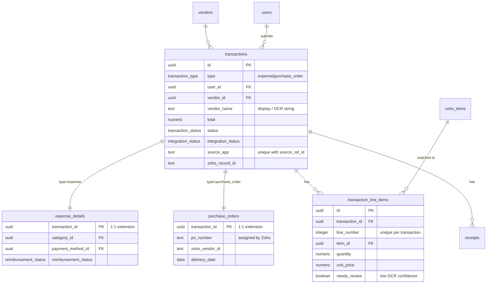
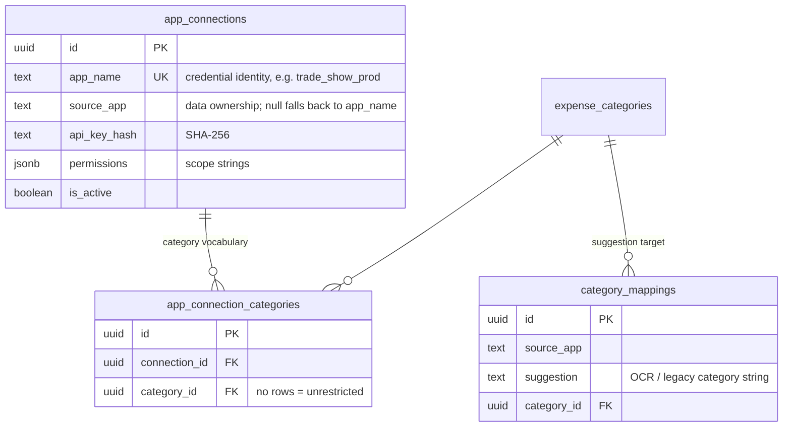
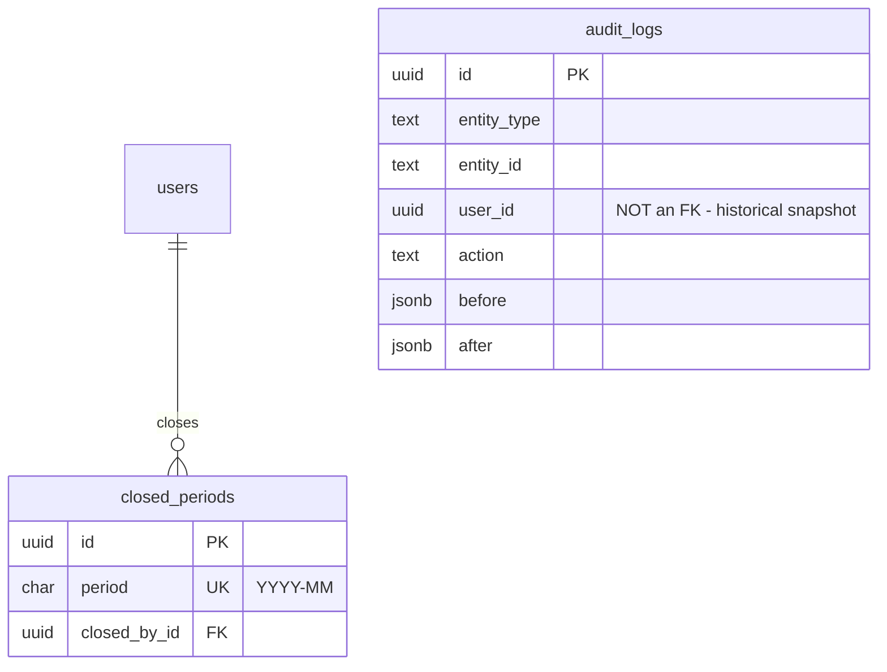
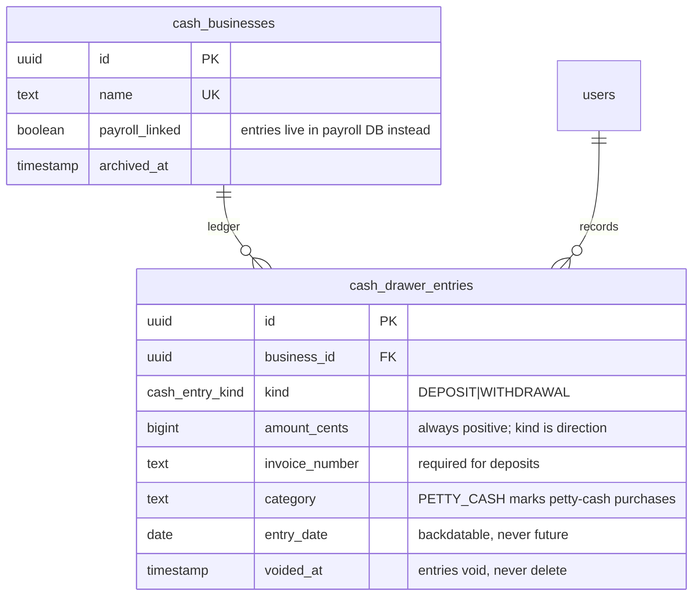

# Midas Database Design

Schema file: `apps/api/src/db/schema.ts` (single source of truth)
ORM: Drizzle ORM + drizzle-kit
Database: PostgreSQL 15 (prod: CT 3220 at 192.168.1.211, reachable only from the app container)

This document is a map, not a mirror — column-level truth lives in `schema.ts`.
Diagrams are grouped by domain because one ERD over all 27 tables is unreadable.

---

## Domains at a glance

| Domain | Tables |
|---|---|
| Identity & auth | `users`, `user_email_aliases`, `sso_links` |
| Reference data | `companies`, `expense_categories`, `category_zoho_accounts`, `payment_methods`, `budgets`, `vendors`, `zoho_items` |
| Expense core | `expenses`, `expense_messages`, `receipts`, `captures`, `notifications`, `push_subscriptions` |
| Transactions & POs | `transactions`, `expense_details`, `purchase_orders`, `transaction_line_items` |
| App integration | `app_connections`, `app_connection_categories`, `category_mappings` |
| Governance | `audit_logs`, `closed_periods` |
| Cashbook | `cash_businesses`, `cash_drawer_entries` |

---

## Identity & auth



- **Username, not email, is the identity key** — an Authentik account with no
  email can still be provisioned.
- `(provider, subject)` is unique: one IdP identity maps to exactly one user.
- Aliases keep external systems working when a person's address changes or two
  accounts merge — submissions sent to an old address still resolve.

## Reference data



- **Company resolution for Zoho:** a category's COA account is looked up in
  `category_zoho_accounts` for the expense's company first, falling back to
  `expense_categories.zoho_account_id`. Beware: the fallback is not
  company-aware, so a missing per-company row can send another org's account id.
- `vendors` and `zoho_items` are caches of Zoho-side records used for PO
  vendor/line-item matching.

## Expense core



- **Workflow status and integration status are separate axes.** `status`
  tracks human review; `integration_status` tracks the Zoho pipeline. The
  legacy `zoho_sync_failed` status value survives for compat, but new writes
  use `approved` + `integration_status='failed'`.
- `(source_app, source_ref_id)` is unique — an external app cannot import the
  same record twice. Both NULL (manual submissions) never collide.
- `expense_messages` is the **canonical conversation record**; any external
  notification channel is notify-only.
- A receipt belongs to an expense **or** a transaction, never both and never
  neither — enforced by a database check constraint, not convention.

## Transactions & purchase orders



- `transactions` is the **shared financial root**: one table for the fields
  every money record needs, with 1:1 extension tables per type. Purchase
  orders live entirely here; classic expenses still live in `expenses`
  (the two models coexist).

## App integration



- External apps call `/api/v1/ext/*` with Bearer keys; only the SHA-256 hash
  is stored. Scopes live in `permissions`
  (see `docs/EXT_API_MERGE_LOCK.md` for the contract).
- A connection with no vocabulary rows sees every active category — restriction
  is opt-in.

## Governance



- `audit_logs` is **append-only** — a trigger rejects UPDATE and DELETE.
  `user_id` is deliberately not a foreign key: an FK cascade could never run
  against immutable rows and made every user in the log undeletable.
- A closed month locks every expense dated in it (no edits, submits, reviews,
  or reimbursement changes). Admin force-delete is the audited override.

## Cashbook



- Money is **integer cents, always**. Ledgers are append-only: entries void,
  they never delete.
- The payroll-linked business has no local rows — its drawer is read from the
  payroll app's database at request time (`lib/payrollDrawer.ts`).

---

## Enums

| Enum | Values |
|---|---|
| `user_role` | `user`, `accountant`, `admin`, `partner`, `developer` |
| `expense_status` | `draft`, `pending`, `in_review`, `awaiting_info`, `approved`, `zoho_sync_failed` (legacy), `rejected`, `cancelled` |
| `transaction_status` | `draft`, `submitted`, `in_review`, `awaiting_info`, `approved`, `rejected`, `cancelled` |
| `integration_status` | `not_required`, `pending`, `queued`, `syncing`, `synced`, `failed` |
| `reimbursement_status` | `not_requested`, `pending`, `approved`, `rejected`, `paid` |
| `ocr_status` | `pending`, `processing`, `done`, `failed` |
| `capture_source` | `extension`, `manual` |
| `capture_status` | `draft`, `linked`, `discarded` |
| `expense_kind` | `business`, `partner` |
| `transaction_type` | `expense`, `purchase_order` |
| `cash_entry_kind` | `DEPOSIT`, `WITHDRAWAL` |

---

## Migration workflow

| Environment | Command | Mechanism |
|---|---|---|
| Local dev | `npm run db:push` | `drizzle-kit push` — direct schema sync, no files |
| Production | `npm run db:generate` → commit SQL → run migrator | Numbered SQL files in `apps/api/drizzle/`, applied by `src/db/runSqlMigrations.ts` |

Production migrations run via the compose `migrator` service **before**
rebuilding the app:

```bash
docker compose -f docker-compose.prod.yml run --rm --build migrator
```

The `--build` flag is required — without it the migrator reuses a stale image
and silently applies nothing. See `docs/OPERATIONS.md` for the full deploy
sequence and `docs/BACKUP_RESTORE.md` before anything destructive.
