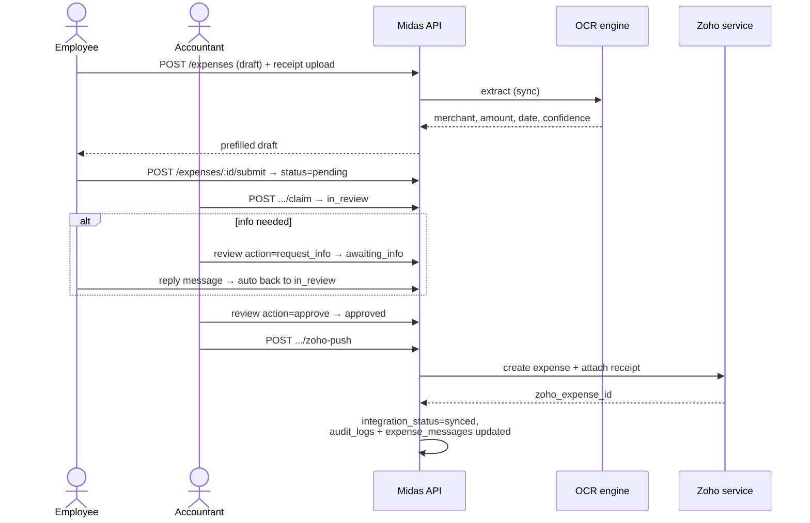

# Midas — Architecture

## Overview

Midas is the canonical Expense Engine: a standalone internal expense platform
that other internal apps (the Trade Show app, Argo, Milo, …) embed rather than
each implementing their own expense tracking, OCR, or reimbursement workflow.
See `docs/EMBEDDING.md` for the two embedding strategies (service delegation
over the app-to-app API, or direct use of Midas's npm packages).

No embedder-specific logic lives in Midas. Every expense can be linked to an
arbitrary external owning entity via the opaque `sourceApp`/`sourceRefId` pair —
see "Extensibility: polymorphic ownership" below.

---

## System diagram

```mermaid
flowchart LR
    subgraph Clients
        B[Browser / PWA]
        X[Chrome extension]
        E[Embedder apps<br/>Trade Show, Argo, Milo]
    end

    subgraph Proxmox host 192.168.1.190
        subgraph CT 104 npmplus
            N[nginx proxy manager<br/>TLS termination]
        end
        subgraph CT 3120 midas-app-prod
            W[midas-web-1<br/>nginx + React build]
            A[midas-api-1<br/>Express + Drizzle]
            U[(uploads/<br/>bind mount)]
        end
        subgraph CT 3220 midas-db-prod
            P[(PostgreSQL 15)]
        end
        AK[CT 111 Authentik<br/>OIDC SSO]
        TS[(Trade show DB<br/>read-only)]
        PR[(Payroll DB<br/>read-only)]
    end

    subgraph External services
        O[OCR engine<br/>CT 9500 :8000]
        Z[Zoho integration service<br/>CT 9503]
        ZB[Zoho Books]
    end

    B -->|HTTPS| N
    X -->|HTTPS| N
    N --> W
    N --> A
    E -->|/api/v1/ext + Bearer key| A
    A --> P
    A --> U
    A -->|OIDC| AK
    A -->|@midas/ocr-client| O
    A -->|ZOHO_MODE=service| Z
    Z --> ZB
    A -->|event calendar| TS
    A -->|cash drawer| PR
```

- TLS lives in npmplus (CT 104), **not** in this repo. Postgres accepts
  connections only from CT 3120 (pg_hba.conf).
- Midas does **not** implement Zoho OAuth or OCR internals. Those live in
  separate services; Midas talks to them over HTTP behind adapters.

---

## Expense lifecycle



### Status model

Workflow status and integration status are **separate axes** on the expense:

| `status` (human review) | `integration_status` (Zoho pipeline) |
|---|---|
| `draft → pending → in_review → awaiting_info → approved / rejected / cancelled` | `not_required → pending → queued → syncing → synced / failed` |

- `zoho_sync_failed` survives as a legacy status value; new writes use
  `approved` + `integration_status='failed'`.
- Transitions without accountant action: employee reply to `awaiting_info`
  auto-returns the expense to `in_review`; extension submissions skip `draft`
  and enter `pending` directly.
- Claim/release are atomic conditional updates that set/clear
  `reviewedById`/`reviewedAt`.
- `reimbursement_status` is a third independent axis
  (`not_requested → pending → approved → paid`).
- "Missing field" conditions (`needs_category`, `missing_receipt`,
  `ready_for_zoho`, …) are **derived flags computed per request**
  (`computeFlags()` in `routes/accountant.ts`), never stored.

### Zoho readiness gate

A push requires: `status='approved'`, a Zoho entity (company), a category, and
a payment method. A receipt is a soft requirement (flag only). Companies with
`zoho_enabled=false` never enter the pipeline at all — their expenses stay
`integration_status='not_required'`.

### Accountant queue

Three lanes, driven by the same derived flags: **Needs Attention** (pending /
awaiting reply), **Missing Fields** (approved but not Zoho-ready), and
**Ready & Processing** (Zoho-ready, syncing, or failed). Bulk approve and bulk
push operate on the visible selection.

### Payment methods

Company cards are catalogued in `payment_methods` (label, last four, Zoho
paid-through account, default entity). Cards flagged `requires_reimbursement`
mark personal/out-of-pocket spend and drive the reimbursement flow. Every
active company appears in the payment-methods UI — including companies that do
not post to Zoho, whose paid-through picker is disabled since there is no Zoho
org to point at.

---

## Repo structure

```
midas/
├── apps/
│   ├── api/             Express + TypeScript + Drizzle ORM backend
│   └── web/             React + Vite + Tailwind frontend
├── extension/           Manifest V3 browser extension
├── packages/
│   ├── shared/          Shared types incl. OwnerRef + MIDAS_VERSION
│   ├── ocr-client/      OCR preprocessing + HTTP adapter + rule-based fallback
│   └── import/          Generic import pipeline (docs/IMPORT_FRAMEWORK.md)
├── docs/
├── docker-compose.yml         base (dev api behavior)
├── docker-compose.local.yml   local Postgres container
├── docker-compose.prod.yml    prod build + migrator service
└── package.json               npm workspaces root
```

---

## Backend

- **Framework:** Express 4 + TypeScript 5, strict mode
- **ORM / migrations:** Drizzle ORM + drizzle-kit — schema in
  `src/db/schema.ts`, SQL migrations committed to `drizzle/`
  (see `docs/DATABASE_DESIGN.md`)
- **Auth:** JWT in an httpOnly cookie — never localStorage. Two modes:
  `AUTH_MODE=local` (password) and `AUTH_MODE=authentik` (OIDC SSO, see
  `docs/AUTHENTIK_SETUP.md`)
- **Middleware chain:** helmet → cors → body-parser → cookie-parser →
  rate-limit → routes → error handler
- **Startup config audit:** in production the API logs loudly at boot when a
  feature-gating env var (VAPID keys, payroll DB, trade-show DB, Zoho) is
  missing, because those features otherwise degrade silently
  (`lib/configAudit.ts`)

### Integration boundaries (adapter pattern)

Integrations sit behind interfaces with `mock` and `service` implementations,
toggled by env:

| Service | Env var | Notes |
|---------|---------|-------|
| OCR | `OCR_MODE=mock\|service` | live engine at CT 9500, via `@midas/ocr-client` |
| Zoho | `ZOHO_MODE=mock\|service` | via the Zoho integration service, `docs/ZOHO_INTEGRATION.md` |
| Storage | `STORAGE_MODE=local\|s3` | prod uses the local bind mount |
| Web push | `VAPID_*` keys | disabled if unset |
| Payroll drawer | `PAYROLL_DATABASE_URL` | read-only, at request time |
| Event calendar | `TRADESHOW_DATABASE_URL` | read-only, at push/filter time |

**Sync model:** Midas is **sync-primary** — expense/receipt/OCR responses
include completed OCR. Offline clients use a client-side upload queue as a
safety net (`docs/SYNC_AND_OFFLINE.md`). Do not treat Midas as async-only.

### API surface

Mounted under `/api/v1/` (see `server.ts` for the authoritative list):

`auth` (+ OIDC), `expenses`, `transactions` (purchase orders),
`…/receipts`, `…/messages`, `captures`, `files` (authenticated streaming — no
public /uploads), `accountant`, `cashbook`, `admin`, `payment-methods`,
`partner-expenses`, `reports`, `budgets`, `companies`, `events`, `vendors`,
`zoho`, `notifications`, `meta`, `health`, and the two machine surfaces below.

Full request/response contracts: `docs/API_CONTRACTS.md`.

### Machine surfaces

- **`/api/v1/ext/*`** — app-to-app API. Bearer API keys issued by an admin;
  only the SHA-256 hash is stored (`app_connections`). Scoped permissions per
  connection; contract frozen in `docs/EXT_API_MERGE_LOCK.md`.
- **`/api/v1/extension/*`** — browser extension. Session cookie auth. Creates
  expense + receipt + capture atomically at `status='pending'`; never
  approves, never calls Zoho (`docs/EXTENSION_DESIGN.md`).

---

## Frontend

- React 18 + Vite + TypeScript + Tailwind; React Router v6; TanStack Query
- Auth state in React Context, populated from `/api/v1/auth/me` on mount
- Axios with `withCredentials: true`
- PWA: installable, web-push notifications (iOS requires Add to Home Screen)
- Vite dev server proxies `/api/*` to port 4000

Main surfaces: Dashboard, My Expenses, New Expense (mobile capture +
inline OCR), Expense detail (receipts, conversation, audit), Accountant queue
(three lanes + bulk actions), Purchase orders, Cashbook, Reports,
Partner expenses, Settings (users, categories, payment methods, chart of
accounts, connections, companies), Admin.

---

## Conversation & audit

- `expense_messages` is the **canonical conversation record** per expense —
  user/accountant messages, system entries, and accountant info-requests with
  resolution state. External channels are notify-only, never authoritative.
- `audit_logs` is append-only (DB trigger rejects UPDATE/DELETE) and records
  before/after snapshots for every state change. Its `user_id` is a historical
  snapshot, deliberately not a foreign key.
- In-app `notifications` + web push (VAPID) + best-effort email mirror the
  events; none of them owns the record.

---

## Extensibility: polymorphic ownership

Every expense can optionally belong to an entity owned by another application
(a trade-show event, a payroll run, …) via `sourceApp` + `sourceRefId` —
Midas's `OwnerRef` concept (`packages/shared`):

```ts
interface OwnerRef {
  ownerType: string; // opaque, e.g. 'trade_show' — chosen by the caller
  ownerId: string;   // opaque id of the owning record
}
```

- Opaque strings; Midas never special-cases an embedder's name.
- `null`/`null` = entered directly in Midas.
- The unique index on `(sourceApp, sourceRefId)` prevents duplicate imports
  and is what `@midas/import` relies on for idempotent re-runs.
- `sourceContext` (jsonb) carries embedder context (eventId, location,
  cardUsed) without app-specific columns.

---

## Design invariants

| Invariant | Why |
|---|---|
| No `event_id` on expenses | Midas is not coupled to any embedder's domain model |
| JWT in httpOnly cookie only | XSS cannot read it |
| No hardcoded service IPs | Every integration endpoint comes from env |
| PostgreSQL enums, not VARCHAR CHECKs | Type safety end to end |
| Receipt owner XOR (expense/transaction) enforced by DB check | Polymorphic ambiguity impossible by construction |
| Audit log append-only at the DB level | Trust in history doesn't depend on application discipline |
| Money in cashbook = integer cents | No float drift in ledgers |
| Extension never approves / never pushes | Capture is not review |
